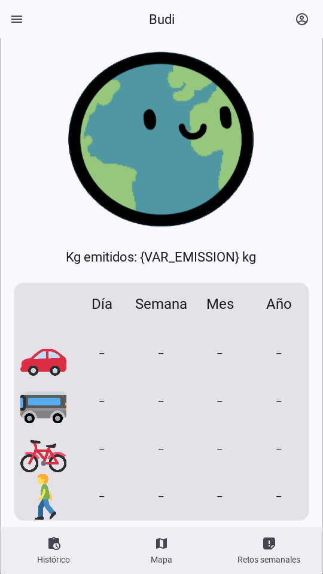
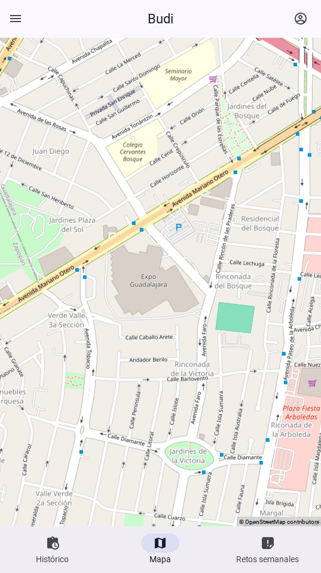
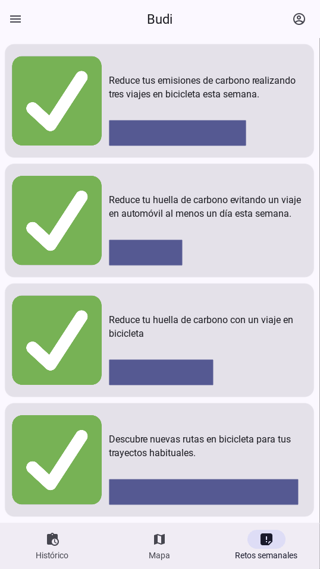

# Budi

## Todo
- [x] Main statistics screen.
- [x] Route recomendation screen.
- [x] Weekly missions screen.
- [x] CI/CD Github actions apk build.
- [ ] Point system.
- [ ] Skins.
- [ ] Ads and marketplace.

## Installation
App is ran using `python3`.

Install requirements with
```bash
pip install -r requirements.txt
```

Run app demo mode in desktop with:
```bash
python3 main.py
```

To run on mobile, install the latest apk from the actions page.

## Apps screens
### Main Statistics


### Route recomendations/tracikng


### Weekly missions
